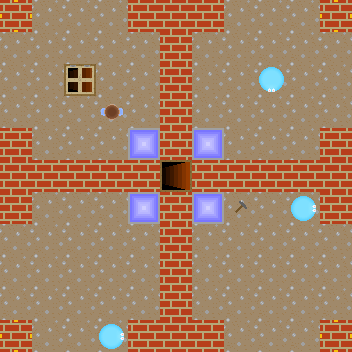

# Labyrinth

A top-down maze game with a custom scripting language, written in Java using Swing.



## Instructions

```sh
git clone https://github.com/tormol/labyrinth
./gradlew run
```

* Move with the arrow keys.
* If there are multiple starting points, you select one with the left/right keys and press enter.

To open a map directly, run  
```sh
./gradlew run --args src/main/resources/maps/multiple_entrances.txt
```

## The scripting language

It's lisp-like, but the function name comes before the opening parenthesis.

* function arguments are separated by spaces: `foo(bar baz)`
* functions start with a `:` and end with a `;`: `if(true :bar() baz();)`
* variables are declared with a leading `.`: `.foo =(+(n 1))`

Example:

```
.entered =("")
.press =(:(c)
    entered =(cat(entered c))
    if(=(entered code) :set(6 8 ' ) set(6 9 ' ) set(7 8 ' );)
;)
```

Built-in functions are defined by StandardLibrary.java and LabyrinthLibrary.java
in src/main/java/no/torbmol/labyrinth/method/

## License

Copyright 2019 Torbjørn Birch Moltu

This program is licensed under the GNU General Public License, as published bythe Free Software Foundation,
either version 3 of the License, or (at your option) any later version.

This program is distributed in the hope that it will be useful, but WITHOUT ANY WARRANTY;
without even the implied warranty of MERCHANTABILITY or FITNESS FOR A PARTICULAR PURPOSE.
See the GNU General Public License for more details.

You should have received a copy of the GNU General Public License along with this program.
If not, see <https://www.gnu.org/licenses/>.

**Utils/ is licensed under different licenses.**
